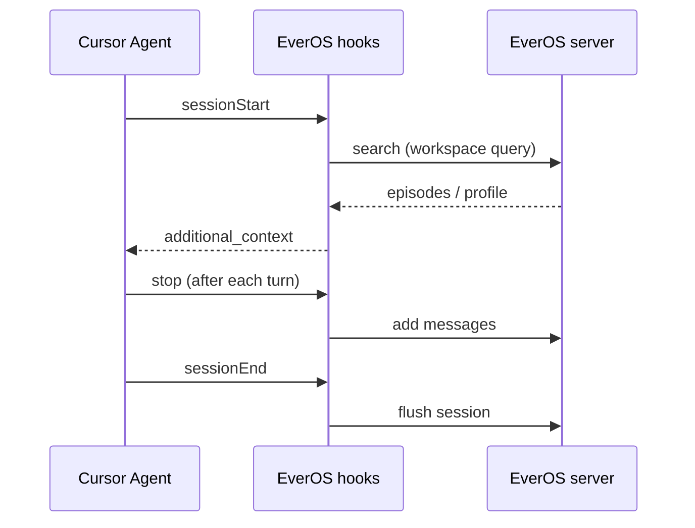

# Cursor Agent Memory (EverOS)

Persistent memory for **Cursor Agent** using the local [EverOS 1.0 HTTP API](https://github.com/EverMind-AI/EverOS/blob/main/docs/api.md). This use case wires [Cursor hooks](https://cursor.com/docs/agent/hooks) so your agent **recalls** past context at session start and **saves** each turn back to EverOS when a session ends.

Unlike the legacy Claude Code plugin in `use-cases/claude-code-plugin/`, this example targets the **current OSS API**:

```text
POST /api/v1/memory/add
POST /api/v1/memory/flush
POST /api/v1/memory/search
```

## What it does

| Cursor hook | EverOS action |
|---|---|
| `sessionStart` | `GET /health` → `POST /search` with a workspace-based query → inject `additional_context` |
| `stop` | Read composer transcript → `POST /add` with the latest user + assistant turn |
| `sessionEnd` | `POST /flush` to extract the session into Markdown-backed memory |



## Prerequisites

- Python 3.12+ (stdlib only — no extra pip packages for the hooks)
- [EverOS](https://github.com/EverMind-AI/EverOS) server running locally (`everos server start`)
- LLM + embedding keys configured in `~/.everos/everos.toml`
- Cursor with **Agent hooks** enabled (see Cursor Settings → Hooks)
- Composer **transcripts** enabled (hooks receive `transcript_path`; without it, save-on-stop is skipped)

## Install into your project

From this directory:

```bash
chmod +x install.sh
./install.sh
```

This copies hook scripts to `.cursor/hooks/everos-memory/` and creates `.cursor/hooks.json` if missing.

If you already have a `.cursor/hooks.json`, merge the entries from `hooks/hooks.json.example`.

Copy and edit environment variables:

```bash
cp env.example .env
# EVEROS_BASE_URL, EVEROS_USER_ID, etc.
```

The hooks load `.env` from the project root (or from this use-case folder during development).

## Verify EverOS is reachable

```bash
curl http://127.0.0.1:8000/health
# {"status":"ok"}
```

Run a manual memory loop (optional):

```bash
TS=$(($(date +%s)*1000))
curl -X POST http://127.0.0.1:8000/api/v1/memory/add \
  -H 'Content-Type: application/json' \
  -d "{\"session_id\":\"cursor-test\",\"app_id\":\"default\",\"project_id\":\"default\",\"messages\":[{\"sender_id\":\"cursor-user\",\"role\":\"user\",\"timestamp\":$TS,\"content\":\"I prefer pytest over unittest.\"}]}"

curl -X POST http://127.0.0.1:8000/api/v1/memory/flush \
  -H 'Content-Type: application/json' \
  -d '{"session_id":"cursor-test","app_id":"default","project_id":"default"}'
```

Open a **new** Cursor Agent chat in the project. Check the **Hooks** output channel for errors.

## Configuration

| Variable | Default | Purpose |
|---|---|---|
| `EVEROS_BASE_URL` | `http://127.0.0.1:8000` | EverOS server |
| `EVEROS_USER_ID` | `cursor-user` | `user_id` for search + `sender_id` on saved messages |
| `EVEROS_APP_ID` | `default` | EverOS scope |
| `EVEROS_PROJECT_ID` | `default` | EverOS scope |
| `EVEROS_SESSION_PREFIX` | `cursor-` | Prepended to Cursor `conversation_id` for `session_id` |
| `EVEROS_TOP_K` | `5` | Search result limit |
| `EVEROS_MIN_SCORE` | `0.1` | Relevance floor |
| `EVEROS_DEBUG` | `0` | Log hook diagnostics to stderr |

## Limitations

- **Local desktop Cursor only** — cloud agents do not run `sessionStart` / `stop` / `sessionEnd` hooks the same way ([Cursor docs](https://cursor.com/docs/agent/hooks)).
- **Per-prompt recall** — Cursor's `beforeSubmitPrompt` hook cannot inject context today; recall happens at **session start** (bootstrap query from the workspace folder name).
- **Eventual search consistency** — after `flush`, wait a moment before expecting `/search` to return new episodes.
- **Transcript format** — save logic expects JSONL composer transcripts compatible with Claude Code-style entries.

## Development

Shared logic lives in `hooklib/`. Unit tests run with the main EverOS suite:

```bash
make test  # includes tests/unit/test_use_cases/test_cursor_agent_memory/
```

## Files

```text
use-cases/cursor-agent-memory/
├── README.md
├── env.example
├── install.sh
├── hooklib/              # stdlib EverOS client + transcript parser
└── hooks/                # Cursor hook entrypoints
    ├── hooks.json.example
    ├── recall_on_session_start.py
    ├── save_on_stop.py
    └── flush_on_session_end.py
```

## License

Apache-2.0 — same as EverOS.
